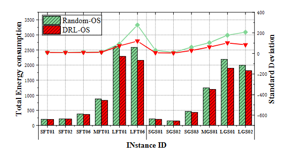

# Flexible-3C-Manufacturing-Workshop-Full-Process-Collaborative-Scheduling-System
# 柔性3C制造车间全流程协同调度系统-基于复杂系统调度的能量最小化辅助学习进化算法

## The main algorithms used
  Unsupervised learning, deep reinforcement learning, intelligent smart optimization algorithms

## Presentation 
  This research addresses the energy minimization task scheduling problem in HCPS. It consists of three subproblems: processor allocation, task sequencing, and determining the processor's execution frequency. We propose a learning-assisted evolutionary algorithm (LEA) to efficiently find reliable and high-quality solutions. In it, a bi-directional long and short-term memory network embedded autoencoder model is developed through end-to-end self-supervised learning. The model extracts the interconnections between three strongly coupled subproblems, which helps to perform an efficient global search in a low-dimensional feature space. The model constructs a parallel framework with two co-evolving subpopulations, one using the autoencoder and the other performing periodic evaluations in the original search space. To balance the exploration and exploitation capabilities of LEA, we adopt a deep reinforcement learning-based approach and utilize a novel feedback control-based reward function to construct a search operator selection scheme. It selects a suitable combination of search operators for two co-evolving subpopulations. Numerical experiments demonstrate that LEA outperforms several recently developed competing methods in finding high-quality plans in a reasonable amount of time.

## Challenges and motivations
  Online scheduling usually requires scheduling in less than five minutes, schedules generated by fast heuristic algorithms usually have limited performance, and population-based evolutionary algorithms take a lot of computation time when solving medium- to large-sized problems. So we are considering whether it is possible to minimize the computation time without degrading the solution quality. This study aims to answer this question by addressing the following two questions: 

1) How to reveal the complex interdependencies among the strongly coupled subproblems of processor allocation, task sequencing and determining processor frequency?
  To solve ETSP effectively, all three interrelated subproblems must be solved. Various optimization frameworks have been proposed by previous authors for synthesizing the scheduling problem to obtain a globally optimal result. However, some methods, such as the branch-and-bound method, can be very time-consuming. Other methods deal with each subproblem in isolation or rely on problem-specific a priori knowledge. A recently developed autoencoder embedded optimization algorithm promises to manage these complexities by mapping the original solution to a low-dimensional space, thus facilitating the generation of high-quality sub-solutions.
  Nonetheless, the original autoencoder embedded optimization algorithm targets continuous optimization problems, and as pointed out in, employing a fully connected layer in an autoencoder hinders feature learning for combinatorial optimization, especially when dealing with non-binary encoded values of binary decision variables. To address this limitation, we propose an autoencoder (BLA) embedded in a bi-directional long- and short-term memory network that captures the interdependencies between decision variables in ETSP. Specifically, we first convert the binary decision variables using a set of long short-term memory units, then use the autoencoder to compress the embedding into a low-dimensional latent representation, and finally we perform some network-embedded search operators in the low-dimensional space to generate the offspring solutions.

2) How to select effective search operators for both the original solution space and the low-dimensional feature space?
  From another point of view, the use of BLA to generate low-dimensional potential representations can be seen as an innovative coding approach. Unlike traditional coding methods that require a specific problem definition and explicit physical meaning, the low-dimensional potential representation does not correspond to a schedule. It has to be reconstructed as a solution in the original space by the decoder used for BLA. This makes the latent representation more of a machine learning coding technique than one that can be readily understood by humans. As a result, meta-heuristic traditional search operators may not be suitable for LEA. DRL provides a promising solution for dynamically recognizing appropriate operators by revealing the current state of the population. Therefore, this study proposes a DRL-based hyper-heuristic for selecting appropriate operators in the primitive and low-dimensional spaces.
  There are other challenges in applying DRL for operator selection. The metaheuristic relies heavily on the random motion of its population. As a result, the same state-operation pairs may be observed with different results, leading to misleading reward signals and thus requiring manual adjustment of the reward function. In addition, evolutionary algorithms do not converge at a consistent rate, usually faster for initial iterations than later ones. A static reward function may hinder the maximization of long-term rewards. Therefore, we propose a novel feedback-based reward function to stabilize the DRL learning process.

## Main contributions
This study proposes a Learning-Assisted Evolutionary Algorithm (LEA) to solve the ETSP problem effectively and efficiently. Its unique contribution is twofold: 
1) A novel BLA model is built through unsupervised end-to-end learning to capture the intrinsic connections among three strongly coupled subproblems. It allows LEA to efficiently perform global search in information-rich low-dimensional spaces. 
2) An adaptive DRL-based iterative search algorithm is proposed for selecting appropriate search operators in both the original and low-dimensional solution spaces. It includes a feedback-based reward function to smooth out the learning process of handling DRL.

## DAG，Directed Acyclic Graph
All tasks in ETSP can be described by a DAG. For example, the following figure shows an example with 9 tasks, where task 8 has two predecessors, which means that it can only be executed after task 3 and task 4 have completed. If the two linked tasks are executed in different processors, the number on the indicator indicates the communication time. For example, it takes 8 units of communication time to execute Task 1 and Task 4 on different processors.

## LEA's Process Framework
  Unlike traditional evolutionary algorithms, LEA integrates two machine learning techniques, namely an autoencoder-based unsupervised learning approach and a DRL-based operator selection scheme. This combination forms a parallel framework that contains two co-evolving sub-populations. One of the subpopulations uses BLA to decompress high dimensions into low dimensional representations for global exploration, while the other subpopulation follows a standard evolutionary process. DRL selects appropriate search operators in these two subpopulations as a kind of hyper-heuristic. As shown in the figure below, LEA consists of two phases: offline training and online execution. The former uses historical data to train the BLA and DRL selectors, while the online phase uses these trained models to search for high-quality schedules, as detailed in the English pseudo-code below.

 **LEA's overall process framework:** 

 **Pseudo-code for LEA:** 

## BLA model
  To the best of our knowledge, various high-quality solutions in ETSPs usually have similar high-fit and low-order sub-solutions. Identifying and retaining these sub-solutions is beneficial, but challenging due to the strong coupling between decision variables. To address this problem, we propose BLA that learns high-fit combinations among decision variables. it reduces the risk of losing valuable subsolutions and thus improves the global search capability of LEA.

  Training database: BLA was introduced to learn sequence data (i.e., yS and yA), similar to techniques used in natural language processing. Drawing inspiration from their progress, we abandoned the practice of forming training datasets directly from complete solutions. Instead, we introduce a rule-based approach that cuts yS and yA into their sub-solutions, thus helping BLA learn more localized information.
First, the BLA is trained using the historical best solutions from the early iterations of LEA and the solutions obtained using the HEFT rule. Then, three rule-based approaches are used to generate sub-solutions: e.g., if the task order of Processor 2 is {7, 3, 4}, this relative execution order will be used as a sub-solution of yS. 2) Generate sub-solutions for frequency-based task allocation schemes. For example, if tasks 2 and 3 are frequently assigned to processor 3 in the best historical solution, a sub-solution {d, 3, 3, d, - - - , d} will be generated for yA, where d represents a padding marker. Note that we use the filler marker d here to keep the length of the BLA input constant.3) By randomly selecting v tasks (where v ∈ {2, ... , n - 1}) for task assignment or ordering scheme to form sub-solutions. For example, if tasks 3, 4, 8, and 10 are selected and their execution sequence is {8, 4, 3, 10} in , then this sequence is used as a sub-solution for training. These rule-based methods are intended to enrich and flesh out the dataset used to train BLA.

  NETWORK ARCHITECTURE: As shown in the figure below, the BLA contains two main components, the BLA encoder and the BLA decoder. This approach was chosen because the task sequence is represented by a series of non-repeating integers, and thus requires a model capable of capturing variable-length sequences. Unlike traditional autoencoders, Z′ is not directly reconstructed to its original form. Instead, our DRL-based operator selection scheme O selects a search operator OB, which is used to generate the variant descendant Z′ from Z. The search operator OB is used to generate the variant descendant Z′ .
The purpose of BLA-Decoder is to reconstruct Z′ into the offspring scheme y′ . As shown below, the BLA-Decoder output of the processor allocation scheme (yA′ ) consists of m-dimensional vector groups. The softmax layer is used to convert them to integer outputs. For example, if the output vector corresponding to task 1 generated using the BLA-Decoder is < 0.02, 0.86, 0.13 >, we use the index of its maximum value as the first element of yA′ , i.e., since 0.86 is the maximum value, we can also generate the task sequence sub-solution yS′ .

## Deep Reinforcement Learning (DRL)-based Operator Selection Strategy for Operations
A key challenge in using DRL for operator selection is to transform the operator selection problem into a DRL problem. Following the principles of DRL, we have the following tasks: state representation, action construction, and reward definition.

 **State space characterization of DRLs:** 

DRL actions: 
  Search operators usually focus on performing extensive local searches, whereas in them they should help LEAs to identify promising solution spaces, i.e., solution spaces enriched with high-quality sub-solutions. To achieve this goal, we propose an operator-based action that modifies existing optimization algorithms and refactors them according to various optimization principles. Through extensive prior runs and analyses, we have selected 20 suitable combinations of operators specifically designed to deal with ETSP. the main operators include: i) single-point crossover and multipoint variational operators; ii) two-point crossover and multipoint variational operators; iii) iterative local search operators; iv) simulated annealing operators; v) improved sparrow search operators; and vi) operators based on earliest-completion-time rule; vii) frost optimization operator and viii) differential evolution operator. At each step of DRL training, we select an operator for the low-dimensional feature space and an operator for the original solution space.

 **PROCESS FRAMEWORK FOR DRL:**

## Test Example Definitions 
Our numerical simulations use a set of benchmark scenarios. It can be found at https://sourceforge.net/projects/taskgraphgen. These scenarios have different problem sizes, ranging from 9 tasks to 252 tasks. A task can be executed in up to 16 processors, with a maximum of 42 preprocessors. The deadline for the DAG application was set to ˆD = 1.3 - ˆC, where ˆC is the time span of the schedule generated through the HEFT rule, according to the recommendations of the peers.

## Sensitivity analysis
 ** Sensitivity analysis of parameter DB:** 
The latent dimension (denoted by DB) of a BLA plays a crucial role in its reconstruction capability. The following figure shows the impact of variations in DB. It can be seen that values that are too small or too large are undesirable. A DB value that is too small may limit the model's ability to capture enough information from the raw data, which may result in the loss of important features. Conversely, a DB value that is too high may produce accurate input reconstructions but fail to effectively capture the essential features of the decision variables. Based on our previous runs, an appropriate choice is DB = ⌈0.25 - n⌉, where n is the number of tasks.

 **Results of different DBs behaving on instance SFT01:**

 **Sensitivity analysis of parameter LR:** The reconstruction ability of LEA is affected by the learning rate LR. The following figure summarizes the impact of different LR values. Too small a learning rate will cause the LEA to easily fall into a local optimum, while too large a learning rate will lead to too many parameter updates and thus deviate from the optimal solution. Based on our previous runs, LR = 0.0003 is an appropriate choice.

 **Results of different LRs performed on instance SFT04:**

 **Sensitivity analysis of parameter γ:** The discount factor, denoted by γ, is used to measure the significance of future returns. We analyzed the impact of different γ as shown below. Due to the large number of iterations required for the metaheuristic, we chose a relatively large γ = 0.95.

 **Results of the performance of different γ on example SFT07: **

## Results of ablation experiments
 **Ablation experiments: the role of the BLA model**

To demonstrate the effectiveness of BLA, we compared the basic genetic algorithm (GA) with its variant, BLA-GA, which is designed to first compress the original population into a low-dimensional space and then directly reconstruct the original population without performing any additional operations. Both algorithms were run independently 10 times in a limited 360 seconds of CPU time, and the results are shown below.
The figure below shows that BLA-GA finds a solution with lower total energy consumption than GA. Theoretically, reconstructing a solution directly from the compression result of the autoencoder without any further processing should result in a pre-compression solution. However, since BLA uses high-quality solutions as training data, it retains some memory of high-fit and low-order sub-solutions. Therefore, using BLA reduces the risk of losing valuable sub-solutions and thus improves the global search capability.

 Results of **GA and BLA-GA (bar graphs show the energy consumption and line graphs show its standard deviation):**

 **Ablation experiment: the role of Deep Reinforcement Learning (DRL)-based operator selection strategy**

  In this section, we investigate the role of the DRL-based operator selection scheme O by comparing two algorithms (i.e., Random-OS and DRL-OS). The former iteratively selects operators randomly in the low-dimensional feature space and the original solution space, while the latter uses O to select these operators. Both algorithms have the same evaluation parameters. The following figure shows the results of Random-OS and DRL-OS for different problem instances. As can be seen from the figure below, the total energy consumption of the solutions obtained by DRL-OS and Random-OS in small-scale instances is comparable, since small-scale instances can easily find near-optimal solutions with both algorithms. However, the overall performance of DRL-OS is significantly better than that of Random-OS in medium and large scale instances, which means that DRL-OS can choose better operators for population evolution.

  In order to delve deeper into the reasons why DRL-OS outperforms Random-OS, we analyze the evolutionary process of the two algorithms. The convergence process of the best fitness value is shown in the energy consumption reduction curve in Fig. The standard deviation of the fitness value is shown in the standard deviation iteration curve in Fig. It can be seen that the convergence speed of DRL-OS is faster than that of Random-OS, and the fitness value of DRL-OS fluctuates more than that of Random-OS during the initial iteration. Subsequently, DRL-OS shows smaller differences in fitness values compared to its counterpart algorithms and focuses on extensive local search. In summary, our DRL-based operator selection scheme helps LEAs to reduce “ineffective search” by utilizing problem-specific knowledge, which significantly enhances their development capabilities.

 **Random-OS and DRL-OS results (bar graphs show energy consumption, line graphs show their standard deviations):**

**Energy reduction curves for Random-OS and DRL-OS:**

**Standard deviation iterative curves for Random-OS and DRL-OS: **

## Algorithm Performance Comparison 
  In this section, we present the algorithms that have been developed through the application of our proposed method and its counterparts (i.e., the GUROBI optimizer, GA, Basic Iterative Local Search (ILS), E-heft, Reinforcement-Assisted ILS (RAILS, etc.), which are either widely regarded as state-of-the-art or have been shown to perform efficiently on the ETSP in recent studies. Comparing LEA to these acclaimed algorithms provides a robust evaluation framework that demonstrates the strengths and weaknesses of LEA against the current best algorithms. And each algorithm is executed independently 10 times. Also if the computation time exceeds certain range bounds, HCPS must suspend the current program and wait for subsequent scheduling. Therefore, we set the stopping conditions to 10, 30, 200, and 500 seconds for the Ultra-Small, Small, Medium, and Large scenarios, respectively. In order to verify whether there is a statistically significant difference between the total energy consumption found by LEA and that found by LGWO, we performed a Wilcoxon-signed-rank test. The results are detailed in Tables I and II.

  While GUROBI performs well on small-scale instances, it spends an unacceptable amount of time searching for solutions on medium- and large-scale instances. The lower and upper bounds of MFT01 found by GUROBI in 20 hours are [724.74, 767.32], respectively. Therefore, we treat our results as high-quality low bounds, and despite the fact that heuristic rules (i.e., E-HEFT) can quickly find feasible solutions, LEA significantly improves the average fitness value over it by 50.40% and 63.91% for small and large instances, respectively. The average fitness values of LEA are improved by 35.62%, 43.70%, 32.98%, 25.16% and 22.11% compared to ILS, GA, RAILS, LGWO and LCS, respectively. The reason for this is that our DRL-based operator scheme is able to deal with populations in different states, e.g., it is often counterproductive to perform a large number of mutations on numerous solutions in the later stages of the search process. This approach could potentially cause the population to ignore potentially high-quality solutions, leading to an "ineffective search". Furthermore, LEA and LGWO are statistically significantly different in almost all instances, except for SFT01-02, SFT04 and SGS01-SGS03, SGS06, LGS04, whereas the p-values for large-scale instances are very small. This is due to the fact that our proposed BLA model can help LEA to effectively perform global search to find and preserve some high-fit and low-order sub-solutions. As a result, LEA can find relatively high-quality solutions without excessive computational burden, making it particularly suitable for solving medium- to large-scale ETSPs.

 **Table I Comparison of GUROBI, E-HEFT, ILS, RAILS, GA, LGWO, LCS, and LEA in small and medium-sized benchmark scenarios** 

**Table II Comparison of GUROBI, E-HEFT, ILS, RAILS, GA, LGWO, LCS and LEA in a large baseline scenario**

## Conclusion 
  This study considers the energy minimization task scheduling problem that arises in HCPS. By considering deadline constraints and dynamic frequency tuning of the processor, we develop a mixed integer programming model. In order to efficiently obtain high-quality scheduling results, we propose a LEA based on BLA and operator selection scheme. its BLA extracts potential relationships between decision variables and is able to perform an efficient global search in low-dimensional space. Its DRL has a reward function based on feedback control for learning optimal operator selection with the aim of finding suitable search operators in both the original solution space and the low-dimensional solution space.LEA employs a parallel framework with two co-evolving subpopulations: one using BLA and the other following the traditional evolutionary process. The exchange of information between the two subgroups allows LEA to strike a balance between exploration and exploitation. Simulation results show that LEA outperforms its competitors.

## Software or libraries used 
matlab 
Reinforcement Learning Library

